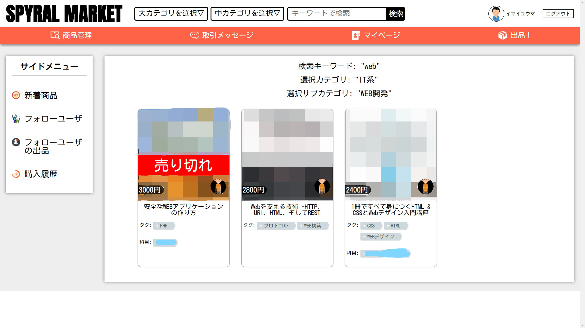

# SPYRAL MARKET

## 概要
1年次の進級作品として制作した自分の所属する学校の生徒向けのフリマサイトです。  
参考書の取引に限定しています。

## 背景
一年間学校で過ごす中で、他学科などの横の繋がり、先輩方などの縦の繋がりを作れる機会が少ないと感じていました。  
普段から縦横の繋がりを広げるきっかけになるものがあればと考え開発に至りました。

## ポイント
科目をタグとして管理しており、また、参考書のタグと科目のタグが結びついているので、  
投稿者が科目の存在を意識することなく投稿できるが、購入者は科目から検索することができます。  

また、自分の受講している科目をプロフィールに登録しておくこともでき、  
トップページのおすすめ商品には自分の受講している科目に関する書籍が並ぶようになっています。

## 使用技術
PHP7.4、Larevel7、Docker(Docker Compose)、HTML、CSS、JavaScript、Vue.js、Maria DB、Git(GitHub)、Pusher API（WebSocket）  
